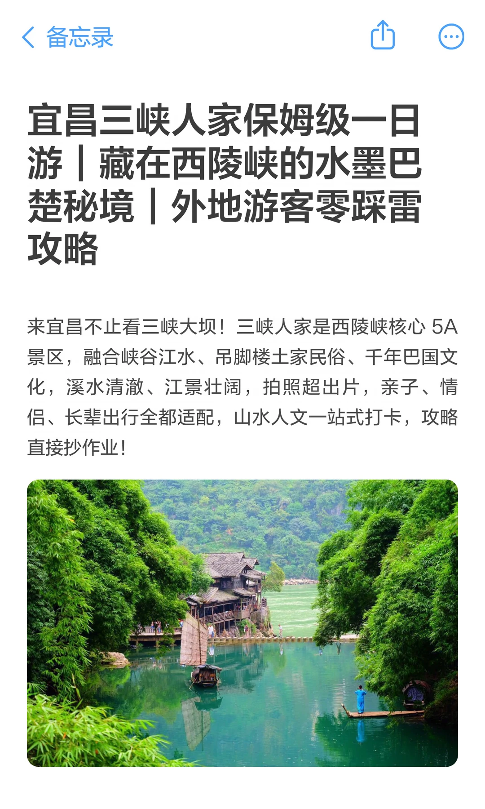
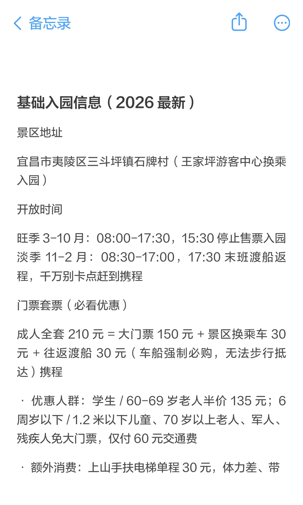
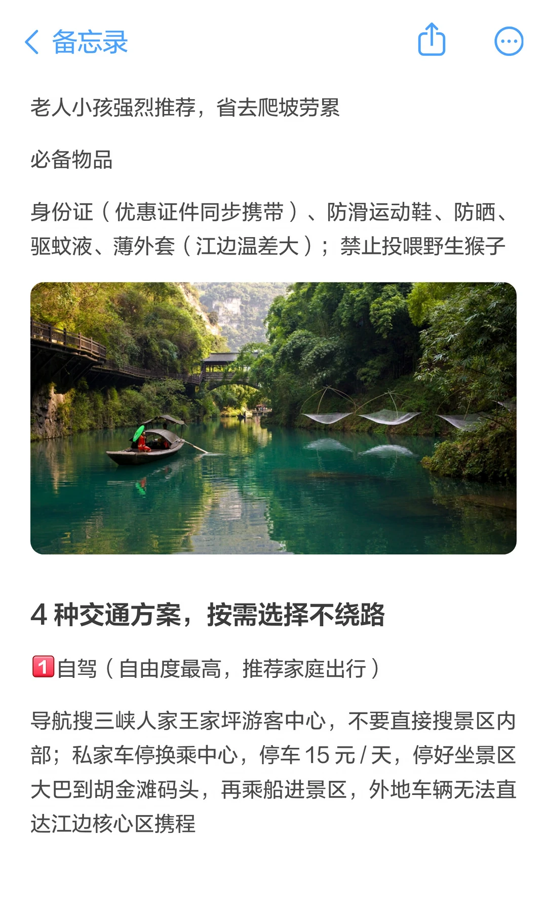
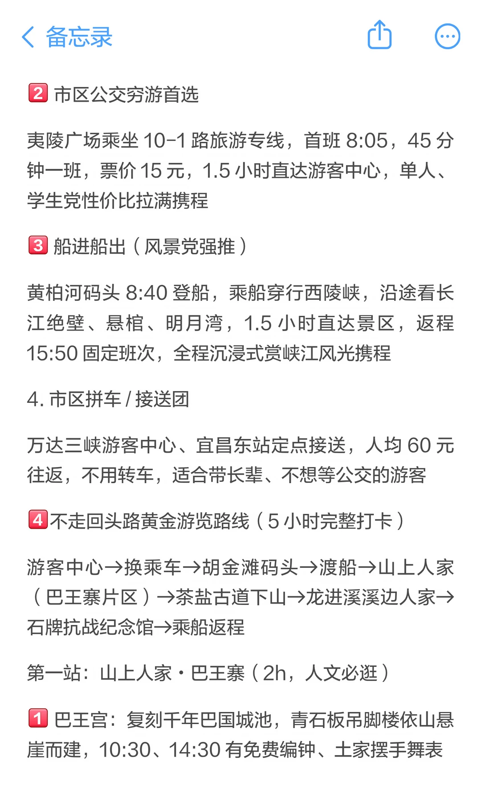
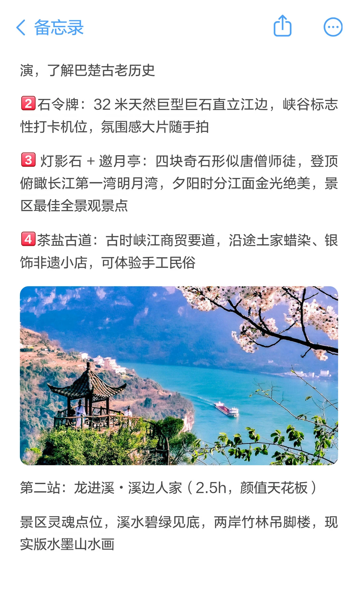
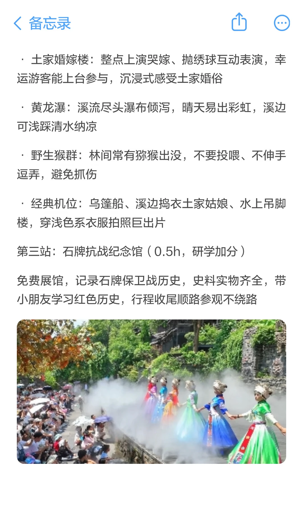
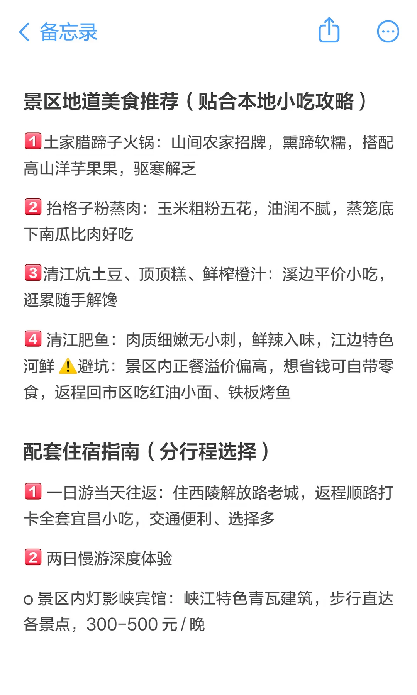
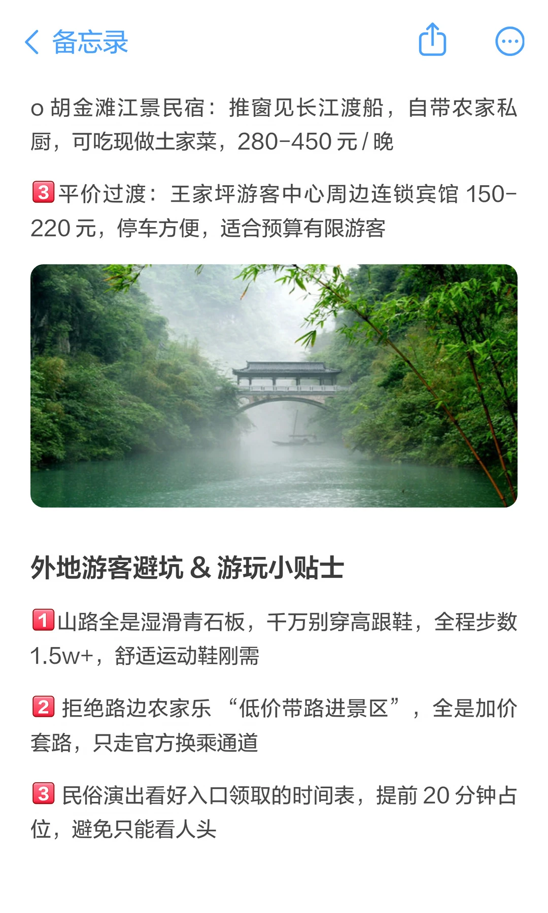

# 宜昌三峡人家保姆级一日游｜藏在西陵峡的水

- 作者: 宜昌向导
- 👍1 · 💬 · ⭐2 · 图 9
- feed_id: 6a436528000000001503db26

> [OCR] 宜昌三峡人家保姆级一日游 | 藏在西陵峡的水墨巴楚秘境 | 外地游客零踩雷攻略

来宜昌不止看三峡大坝！三峡人家是西陵峡核心 5A 景区，融合峡谷江水、吊脚楼土家民俗、千年巴国文化，溪水清澈、江景壮阔，拍照超出片，亲子、情侣、长辈出行全都适配，山水人文一站式打卡，攻略直接抄作业！

> [OCR] 基础入园信息（2026 最新）

景区地址

宜昌市夷陵区三斗坪镇石牌村（王家坪游客中心换乘入园）

开放时间

旺季 3-10 月：08:00-17:30，15:30 停止售票入园
淡季 11-2 月：08:30-17:00，17:30 末班渡船返程，千万别卡点赶到携程

门票套票（必看优惠）

成人全套 210 元 = 大门票 150 元 + 景区换乘车 30
元 + 往返渡船 30 元（车船强制必购，无法步行抵达）携程

· 优惠人群：学生 / 60-69 岁老人半价 135 元；6
周岁以下 / 1.2 米以下儿童、70 岁以上老人、军人、
残疾人免大门票，仅付 60 元交通费

· 额外消费：上山手扶电梯单程 30 元，体力差、带

> [OCR] 备忘录

老人小孩强烈推荐，省去爬坡劳累

必备物品

身份证（优惠证件同步携带）、防滑运动鞋、防晒、驱蚊液、薄外套（江边温差大）；禁止投喂野生猴子

4种交通方案，按需选择不绕路

1. 自驾（自由度最高，推荐家庭出行）

导航搜三峡人家王家坪游客中心，不要直接搜景区内部；私家车停换乘中心，停车 15 元 / 天，停好坐景区大巴到胡金滩码头，再乘船进景区，外地车辆无法直达江边核心区携程

> [OCR] 2 市区公交穷游首选

夷陵广场乘坐 10-1 路旅游专线, 首班 8:05, 45 分钟一班, 票价 15 元，1.5 小时直达游客中心, 单人、学生党性价比拉满携程

3 船进船出（风景党强推）

黄柏河码头 8:40 登船, 乘船穿行西陵峡, 沿途看长江绝壁、悬棺、明月湾，1.5 小时直达景区, 返程 15:50 固定班次, 全程沉浸式赏峡江风光携程

4 市区拼车 / 接送团

万达三峡游客中心、宜昌东站定点接送, 人均 60 元往返，不用转车，适合带长辈、不想等公交的游客

4 不走回头路黄金游览路线（5 小时完整打卡）

游客中心→换乘车→胡金滩码头→渡船→山上人家 （巴王寨片区）→茶盐古道下山→龙进溪溪边人家→石牌抗战纪念馆→乘船返程

第一站：山上人家 · 巴王寨（2h，人文必逛）

1 巴王宫: 复刻千年巴国城池, 青石板吊脚楼依山悬崖而建, 10:30、14:30 有免费编钟、土家摆手舞表

> [OCR] 备忘录

演,了解巴楚古老历史

2 石令牌：32米天然巨型巨石直立江边,峡谷标志性打卡机位,氛围感大片随手拍

3 灯影石+邀月亭:四块奇石形似唐僧师徒,登顶俯瞰长江第一湾明月湾,夕阳时分江面金光绝美,景区最佳全景观景点

4 茶盐古道：古时峡江商贸要道，沿途土家蜡染、银饰非遗小店，可体验手工民俗

第二站:龙进溪·溪边人家(2.5h,颜值天花板)

景区灵魂点位,溪水碧绿见底,两岸竹林吊脚楼,现实版水墨山水画

> [OCR] · 土家婚嫁楼：整点上演哭嫁、抛绣球互动表演，幸运游客能上台参与，沉浸式感受土家婚俗

· 黄龙瀑：溪流尽头瀑布倾泻，晴天易出彩虹，溪边可浅踩清水纳凉

· 野生猴群：林间常有猕猴出没，不要投喂、不伸手逗弄，避免抓伤

· 经典机位：乌篷船、溪边捣衣土家姑娘、水上吊脚楼，穿浅色系衣服拍照巨出片

第三站：石牌抗战纪念馆（0.5h，研学加分）

免费展馆，记录石牌保卫战历史，史料实物齐全，带小朋友学习红色历史，行程收尾顺路参观不绕路

> [OCR] 景区地道美食推荐（贴合本地小吃攻略）

1 土家腊蹄子火锅：山间农家招牌，熏蹄软糯，搭配高山洋芋果果，驱寒解乏

2 抬格子粉蒸肉：玉米粗粉五花，油润不腻，蒸笼底下南瓜比肉好吃

3 清江炕土豆、顶顶糕、鲜榨橙汁：溪边平价小吃，逛累随手解馋

4 清江肥鱼：肉质细嫩无小刺，鲜辣入味，江边特色河鲜！避坑：景区内正餐溢价偏高，想省钱可自带零食，返程回市区吃红油小面、铁板烤鱼

配套住宿指南（分行程选择）

1 一日游当天往返：住西陵解放路老城，返程顺路打卡全套宜昌小吃，交通便利、选择多

2 两日慢游深度体验

o 景区内灯影峡宾馆：峡江特色青瓦建筑，步行直达各景点，300-500元/晚

> [OCR] 备忘录

○ 胡金滩江景民宿：推窗见长江渡船，自带农家私厨，可吃现做土家菜，280-450元/晚

3 平价过渡：王家坪游客中心周边连锁宾馆 150-220 元，停车方便，适合预算有限游客

外地游客避坑 & 游玩小贴士

1 山路全是湿滑青石板，千万别穿高跟鞋，全程步数
1.5w+，舒适运动鞋刚需

2 拒绝路边农家乐“低价带路进景区”，全是加价套路，只走官方换乘通道

3 民俗演出看好入口领取的时间表，提前 20 分钟占位，避免只能看人头

> [OCR] 4 江边昼夜温差大, 春夏多雨, 备一次性雨衣; 溪谷蚊虫多, 驱蚊液必备

5 最佳游玩季节 4-6月、9-11月，江水清澈云雾缭绕，避开盛夏酷暑

6 本地人搭配吃法：逛完三峡人家，返程市区夜市安排小龙虾 + 冰镇凉虾, 中和土家菜厚重咸香。

## 正文
#三峡人家攻略 #宜昌西陵峡旅游 #宜昌 5A 景区 #外地游客宜昌指南 #土家民俗打卡 #三峡一日游 #宜昌吃住行游购娱 #三峡秘境拍照地

---