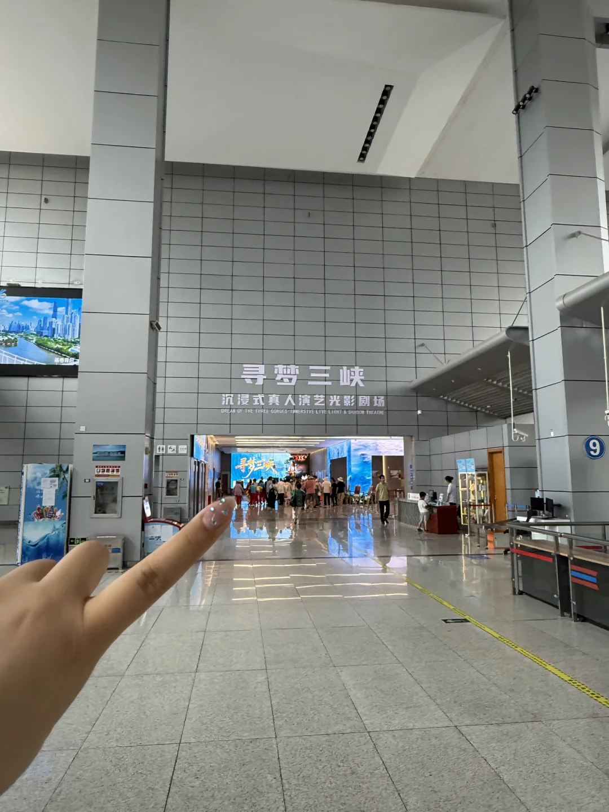
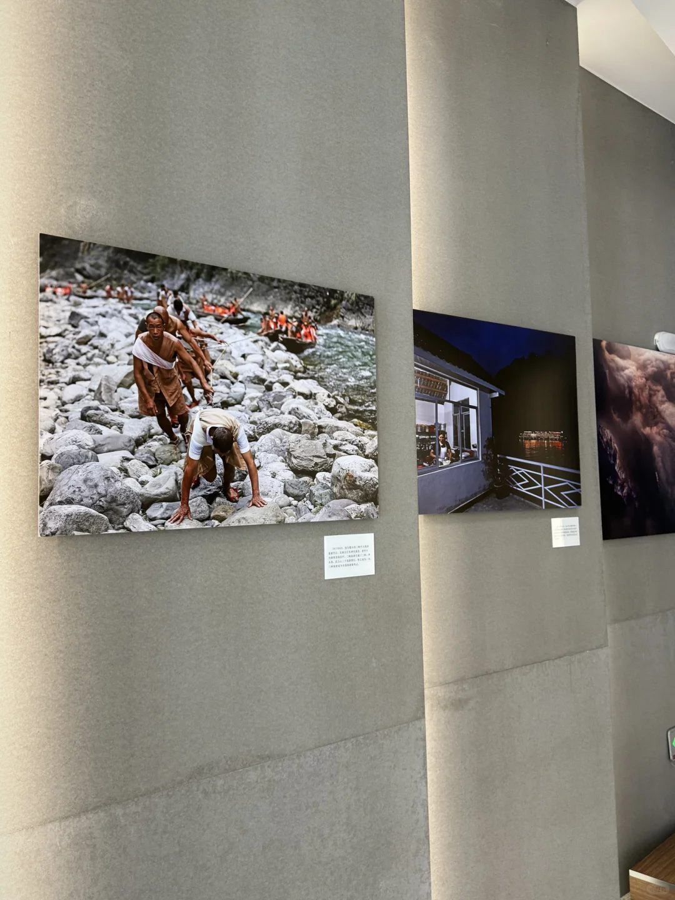
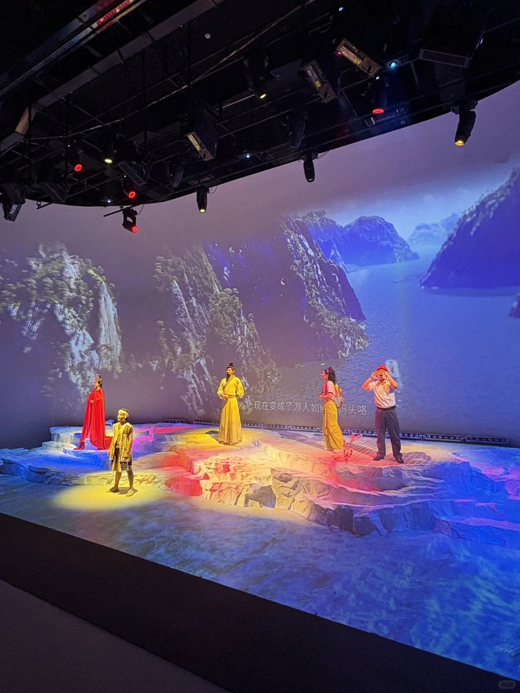
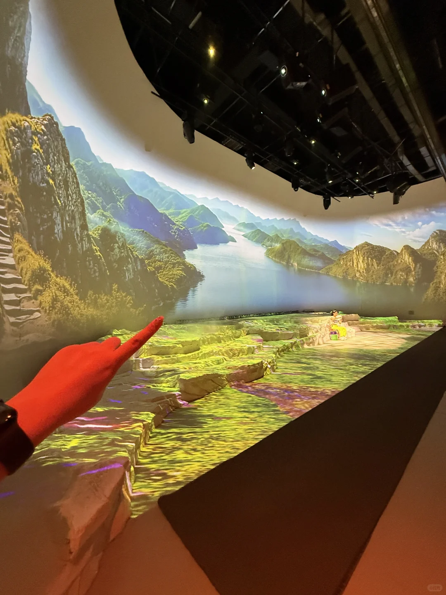
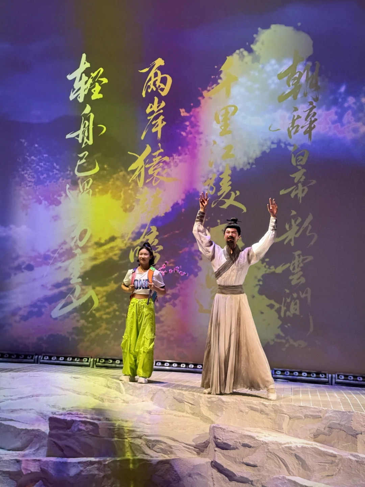
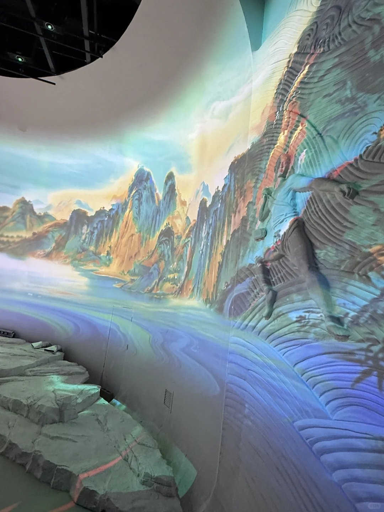
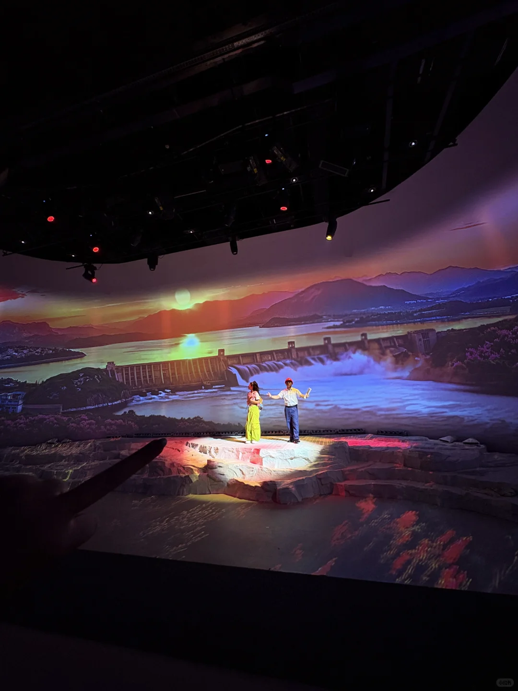
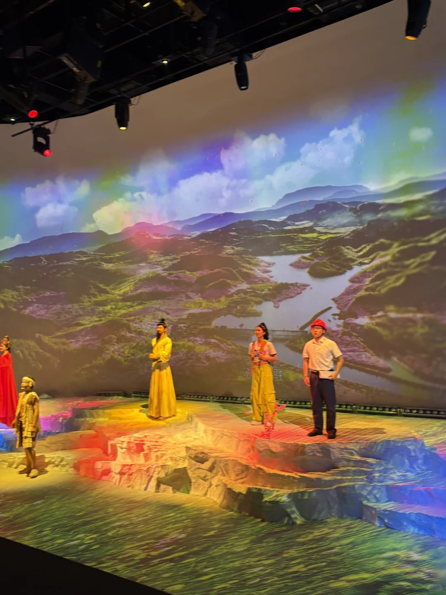
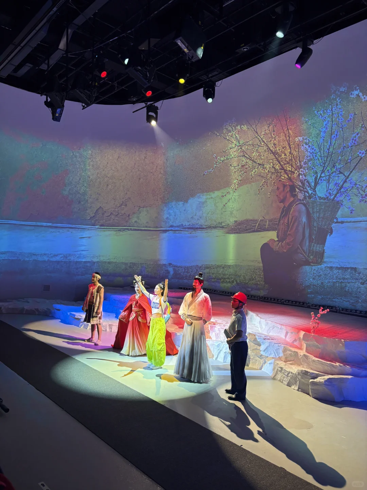

# 三峡大坝打卡｜《寻梦三峡》一定要看！

- 作者: 织梦裁光
- 👍1 · 💬 · ⭐ · 图 12
- feed_id: 6a6ef20d000000002202c542

> [OCR] 寻梦三峡
沉浸式真人演艺光影剧场
DREAM OF THE THREE GORGES IMMERSIVE LIVE LIGHT & SHADOW THEATRE
9

> [OCR] 到三峡大坝必看的演出
EST.1908

> [OCR] 2017-2018年，雅鲁藏布江下游地区发生严重洪灾，造成大量人员伤亡和财产损失。为了救援被困群众，当地村民自发组织了人力运输队，通过搭建简易桥梁的方式将物资运送到受灾区域。

> [OCR] 该问一下她中堡岛咋个走的

> [OCR] 现在变成了游人如织的码头咯

> [OCR] [?]

> [OCR] 朝辞白帝彩云间
千里江陵一日还
两岸猿声啼不住
轻舟已过万重山

> [OCR] [?][?]

> [OCR] [?][?]

> [OCR] 就再也

> [OCR] [?]
[?]

## 正文
谁懂啊家人们！这次去三峡大坝没白跑，居然挖到了新的宝藏演出，《寻梦三峡》。
	
✨20分钟沉浸式光影太会了。
跟着带桃树寻根的小姑娘走，
撞见李白、昭君，耳边是老峡江的纤夫号子。
最后才发现，她找了好久的爷爷的故土，早就成了大坝稳稳的基石！
	
💥270度环绕巨幕+15米巨型水帘
水浪直接往你眼前扑，视觉冲击力拉满。
原来我们站在大坝上踩的根本不是冷石头，是上百万三峡人搬着家离开时，揣了一辈子的乡愁，是他们咬着牙硬扛出来的担当，之前只觉得大坝宏伟，这次才算真的读懂它。
	
📍演出地点：三峡大坝游客换乘中心二楼「寻梦三峡剧场」
⏰演出时间：8:00—16:40 循环演出，随到随看超方便
⏱️演出时长：约20分钟，沉浸式体验不拖沓
🎫票价：65元/人，性价比拉满
去过的姐妹评论区聊聊，你最戳的是哪一幕？👇
#宜昌旅游[话题]# #寻梦三峡[话题]# #三峡旅游攻略[话题]# #宜昌小众打卡[话题]# #湖北旅游[话题]# #三峡演出[话题]# #周末去哪儿玩[话题]#

---