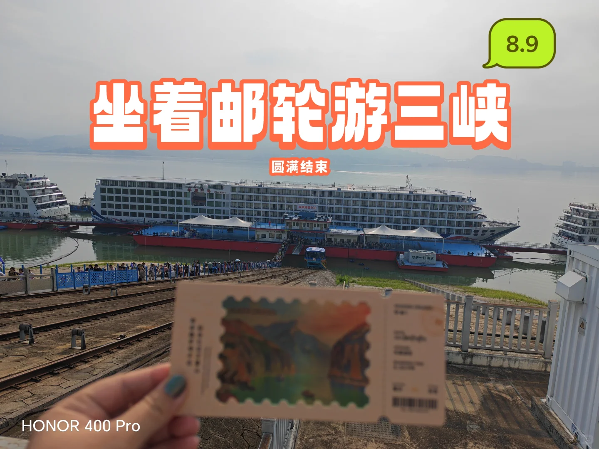
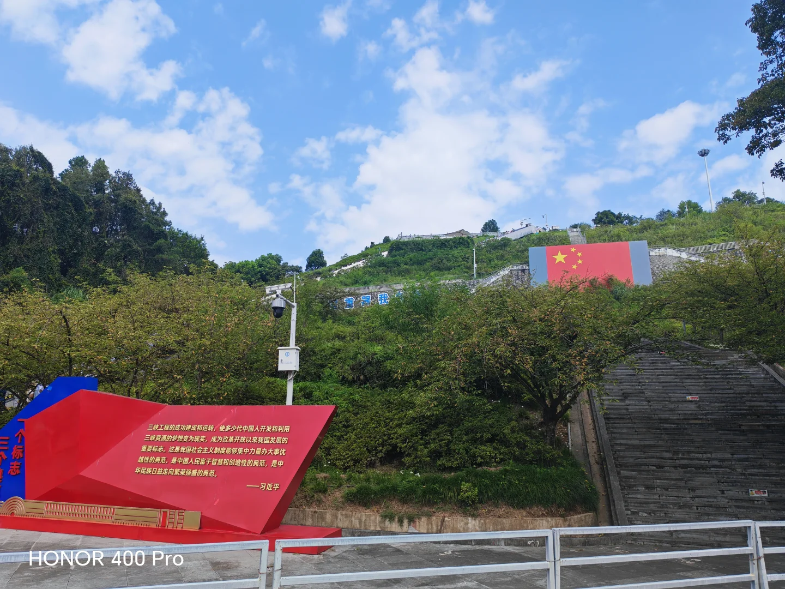
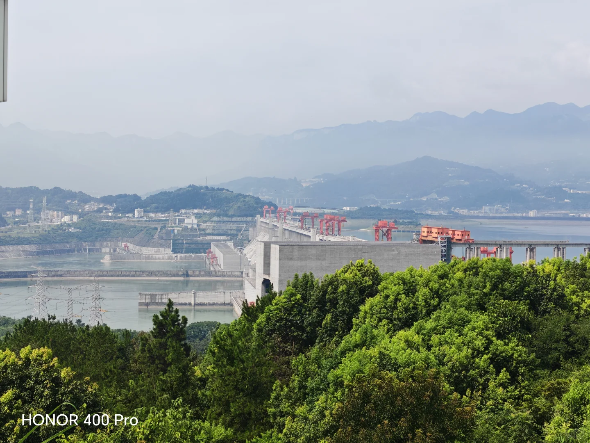
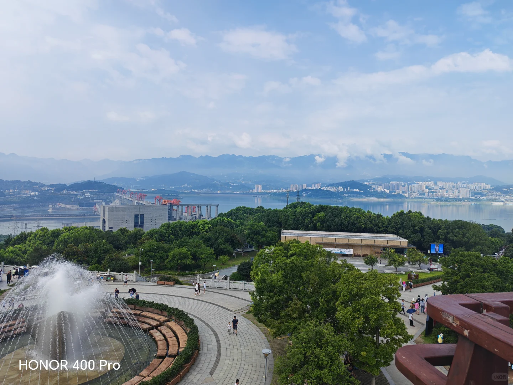
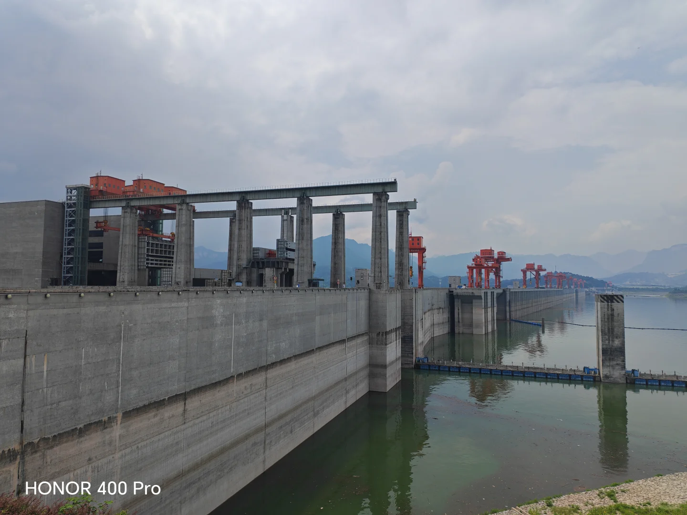
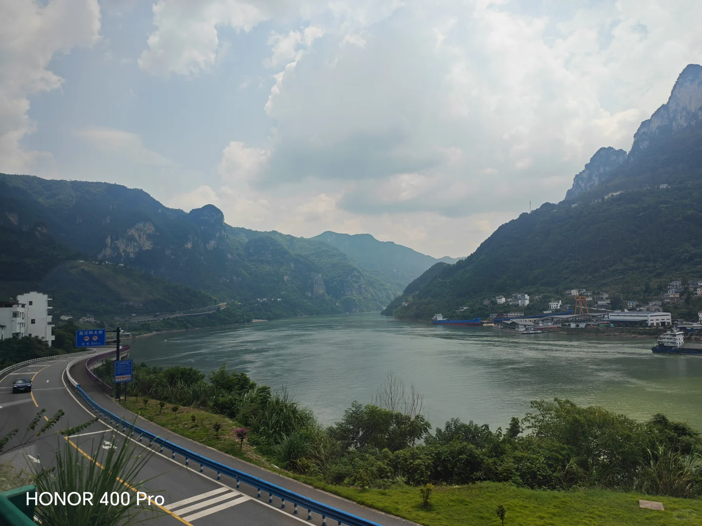
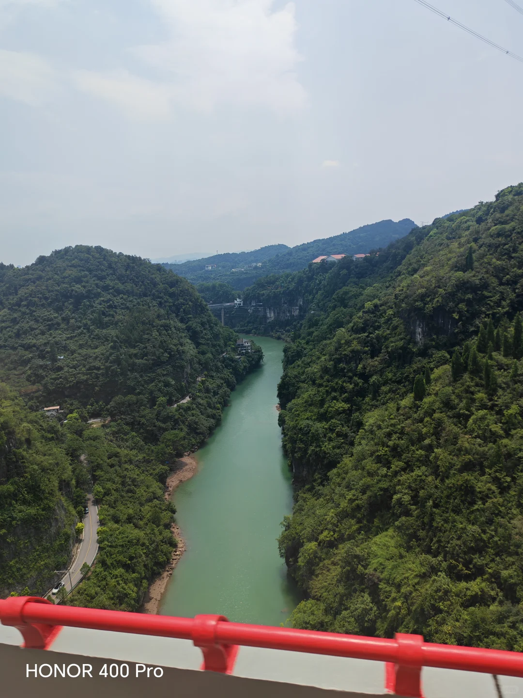

# 8.9坐着邮轮游三峡之逛三峡大坝

- 作者: 安雅拉🎈
- 👍1 · 💬 · ⭐ · 图 7
- feed_id: 6a78924b0000000029033557

> [OCR] 8.9
坐着邮轮游三峡
圆满结束
HONOR 400 Pro

> [OCR] 三峡工程的成功建成和运转，使多少代中国人开发和利用
三峡资源的梦想变为现实，成为改革开放以来我国发展的重要标志。
这是我国社会主义制度能够集中力量办大事优越性的典范，
是中国人民富于智慧和创造性的典范，
是中华民族日益走向繁荣强盛的典范。

——习近平

HONOR 400 Pro

> [OCR] HONOR 400 Pro

> [OCR] HONOR 400 Pro

> [OCR] HONOR 400 Pro

> [OCR] HONOR 400 Pro

> [OCR] HONOR 400 Pro

## 正文
今天是在船上的最后一天，早上起来收拾好所有的东西，（头一天晚上就把大的行李箱寄放在邮轮的前台，他们会帮忙送到三峡游客中心，我们轻装上阵）。我们从秭归港上岸，秭归港有个像电梯箱一样的缆车，可以坐着上大堤，结果我们排到跟前了，缆车坏到半道了，自己爬吧，运气不好但是比困在缆车里的人要稍微幸运一些。
上了岸就进了当地的旅行团，这导游以前是干幼师的吧，说一句话能提三句问题让大家接话，这也就是我不爱跟团的原因，闹腾。
大巴车坐了40分钟就到三峡大坝景区，其实三峡大坝属于军事管理区，进出都有武警站岗。
看到三峡大坝还是很震撼的，国之重器就在眼前，壮丽，巨大，雄伟，现在三峡新航道又开建了，以后会更美好。
逛完三峡大坝，回到宜昌三峡游客中心，我们这次邮轮游三峡的路程就彻底结束了。这次旅行玩的也不累吃的也不错，最重要是第一次体验躺着就能从一个城市到另一个城市，这种感觉太好了。
至此，长江上的主要城市，重庆，宜昌，武汉，南京，上海，我全都去过了。每个城市和长江的融合感都不一样，各有各的美。#视听长江遇见知音湖北[话题]# #游轮[话题]# #坐船看风景[话题]# #旅游在路上[话题]# #长江邮轮[话题]# #华夏三号[话题]# #宜昌[话题]# #三峡大坝[话题]#

---