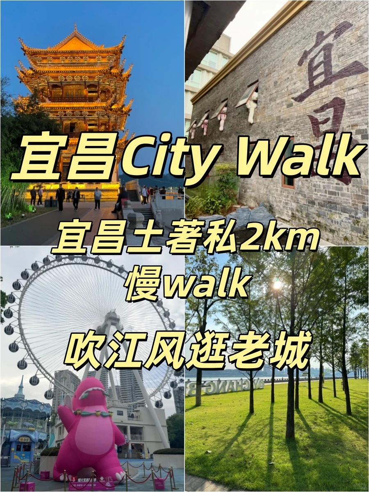
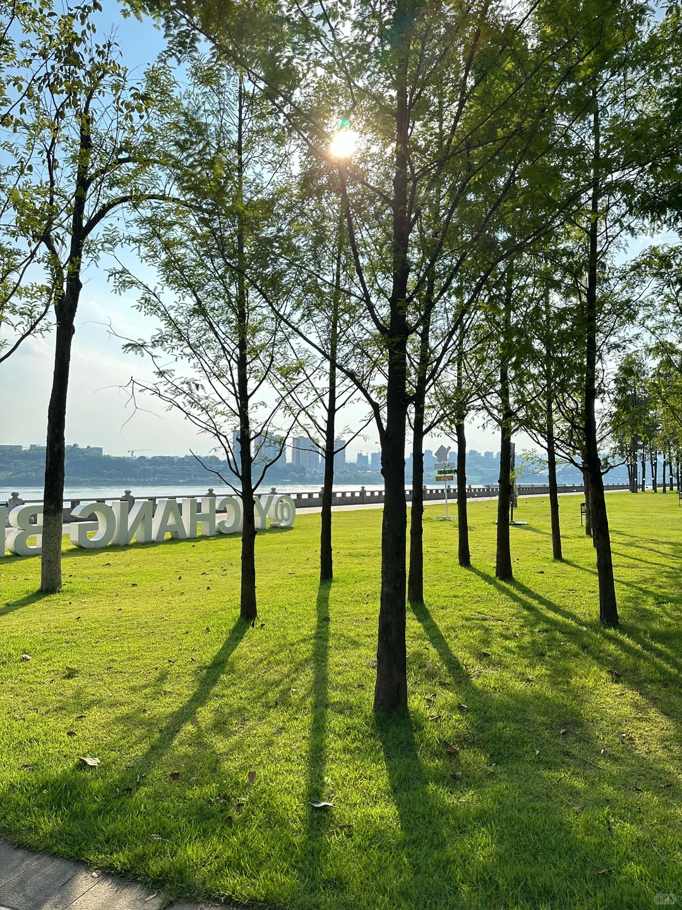
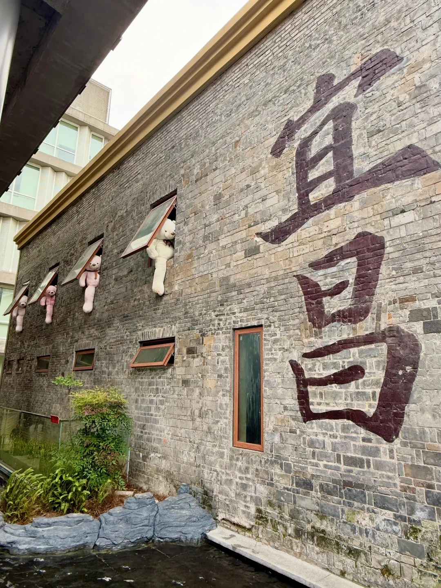
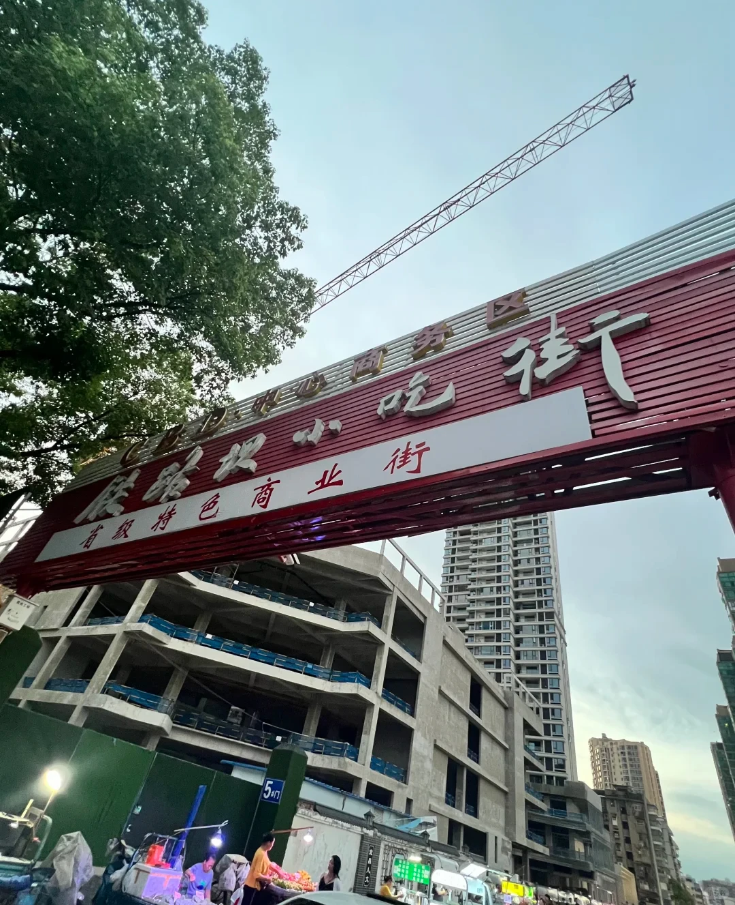
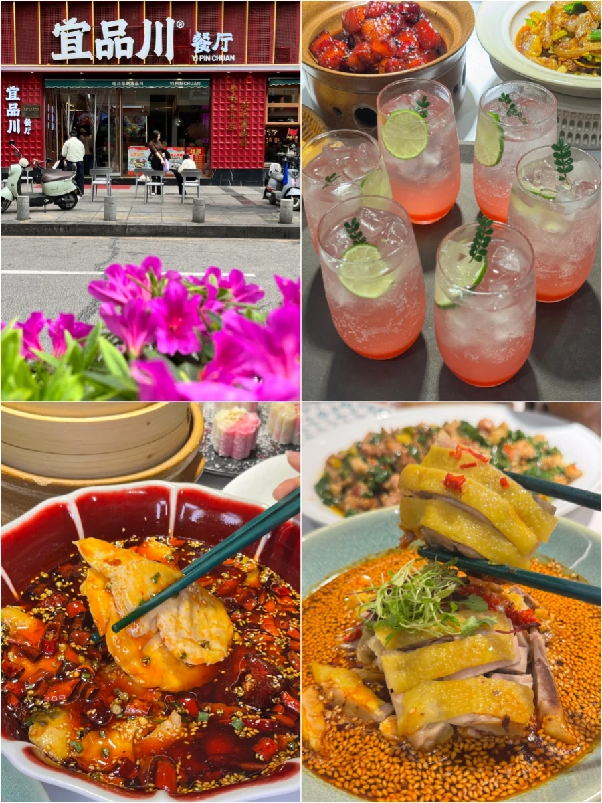

# 宜昌土著私藏2km慢walk，吹江风逛老城✨✨

- 作者: 宜品川
- 👍1 · 💬 · ⭐7 · 图 7
- feed_id: 6a1bf14b000000000803c83a

> [OCR] 宜昌City Walk
宜昌土著私2km
慢walk
吹江风逛老城

> [OCR] CHANGBAIYUAN

> [OCR] [?]

> [OCR] 小红书

> [OCR] 胜路坝小吃街
省级特色商业街
5门

> [OCR] 宜品川®餐厅
YI PIN CHUAN

## 正文
作为土生土长宜昌人
真心劝来宜昌旅游的宝子
别天天赶景点走马观花了！
来江边慢悠悠走一走
沉浸式感受我们宜昌人的慢生活
傍晚吹着长江晚风，看着江边散步的本地人
上班积攒的疲惫直接一键清空✨
	
📌路线顺序
滨江公园→二马路历史街区→解放路步行街→儿童公园→铁路坝小吃街
	
[气球R]第一站：滨江公园
本地人每天必逛的，没有之一！
全长24km沿江绿道，绿化拉满，满眼都是绿意
不想走路直接打车/公交到【市政府站】
过马路直达江边，不用绕远路
走下江滩步梯近距离吹江风，看长江滚滚东流
想多逛一会直接扫共享单车，专属非机动车道巨平坦，骑车沿江逛超舒服
❗️本地避雷Tips：
• 江边风很大，傍晚记得带件薄外套，早晚温差明显
• 不用从头到尾走完滨江公园，太长了！选市政府这段精华段拍照就够
	
[气球R]第二站：二马路历史文化街区
宜昌老城区的浪漫，全藏在这里
直接导航满意楼，必打卡！
随手拍都是复古大片，完全不用滤镜
面对满意楼往左走几步，就是宜昌城市地标打卡牌
来宜昌必拍合照，留住旅行纪念
❗️本地避雷Tips：
• 街区很小，不用特意预留很久时间，15分钟足够拍完
• 街边文创小店溢价偏高，看看拍照就行，不建议盲目消费
	
[气球R]第三站：解放路步行街
老宜昌曾经最繁华的中心老街✨
烟火气拉满，逛累逛渴了直接安排本地解暑神器→王氏凉虾
本地人夏天都在排队喝，清甜解腻，无添加，比奶茶健康太多！
❗️本地避雷Tips：
• 步行街主干道很多网红小吃又贵又难吃，别乱买
• 认准王氏凉虾总店，路边杂牌凉虾口感差很多，别踩雷
	
[气球R]第四站：儿童公园
免费入园！免费入园！免费入园！
宜昌几代人的童年回忆，全园清新蓝调配色
不想玩游乐项目纯散步拍照完全没问题
❗️本地避雷Tips：
• 园内游乐项目单独收费，性价比一般，不推荐专门花钱玩
	
[气球R]第五站：铁路坝小吃街（干饭人终点站）
来宜昌必吃的美食聚集地，闭眼吃不踩雷（本地人认证）
✅易姐萝卜饺子
✅周记烤蹄王
✅宜品川：正宗的川菜馆，人均四五十闭眼冲
❗️本地避雷Tips：
• 小吃街人流大，看好随身物品
• 萝卜饺子现炸需要排队，赶时间可以避开饭点
	
❤️土著真心话
宜昌从来不是靠人山人海景点出圈的城市
慢下来吹江风、逛老街、吃路边小吃
才是打开这座城市最好的方式❤️
来宜昌玩照着这条线走，省心又舒服，不赶行程不费腿～
#宜昌旅游[话题]#  #宜昌citywalk[话题]#  #宜昌攻略[话题]#  #宜昌本地人推荐[话题]#  #宜昌江边[话题]#  #宜昌美食[话题]#  #宜昌一日游[话题]#  #湖北旅游[话题]#  #宜昌避雷攻略[话题]#

---