# 宜昌慢漫游攻略，山水老城一站式打卡🌿

- 作者: 维唯
- 👍1 · 💬4 · ⭐2 · 图 12
- feed_id: 6a796cd90000000033011789

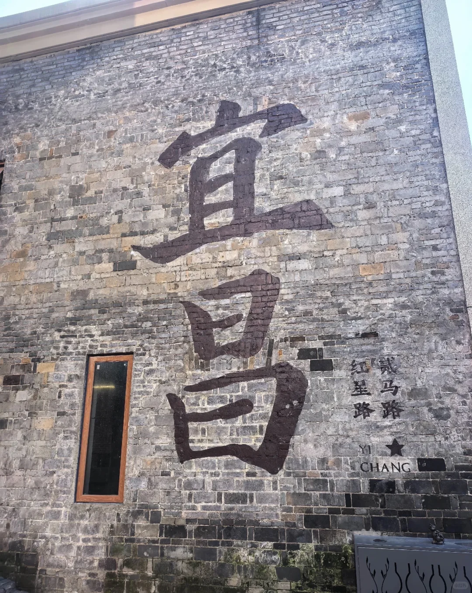
> [OCR] 宜马
红星路
YI
CHANG
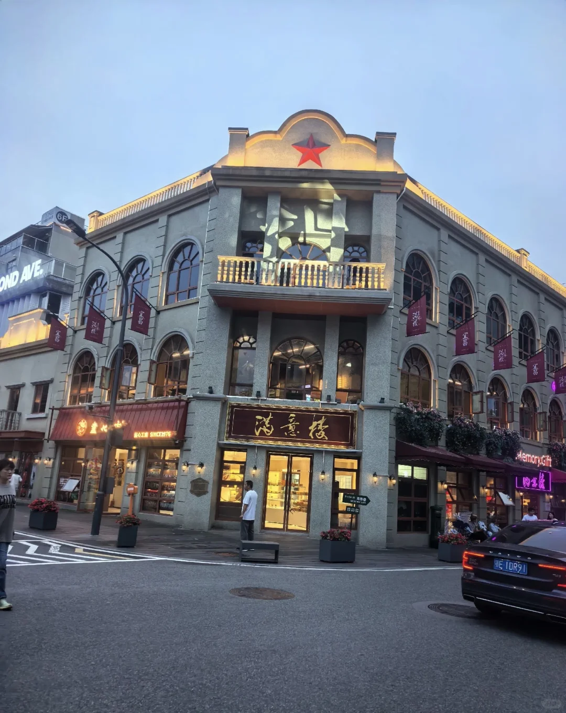
> [OCR] ND AVE.
滿意樓
Memory.Gift
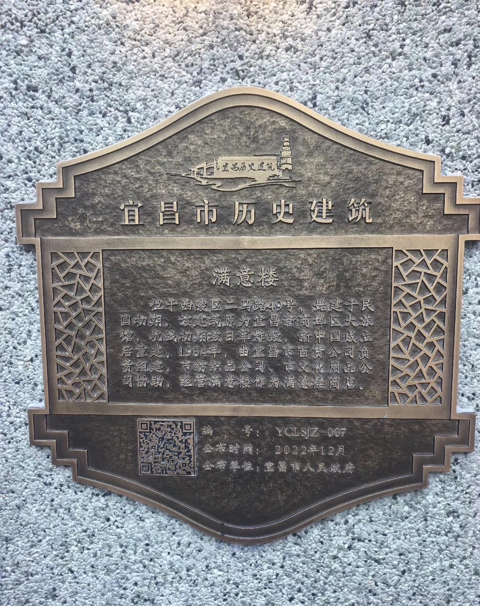
> [OCR] 宜昌市历史建筑

满意楼
位于西陵区二马路49号，始建于民国初期，该建筑原为宜昌新商埠区大旅馆，抗战初期被日军炸毁，新中国成立后重建。1954年，由宜昌市百货公司负责组建，市纺织品公司、市文化用品公司协助，经营满意楼作为满意楼商店。

编号：YCLSJZ-007
公布时间：2022年12月
公布单位：宜昌市人民政府
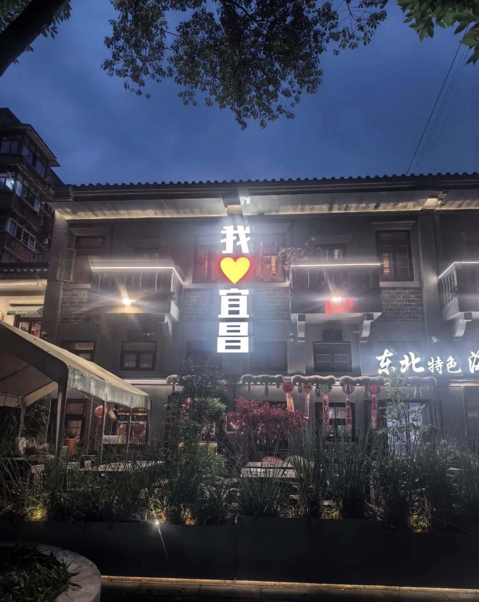
> [OCR] 我❤宜昌
东北特色店
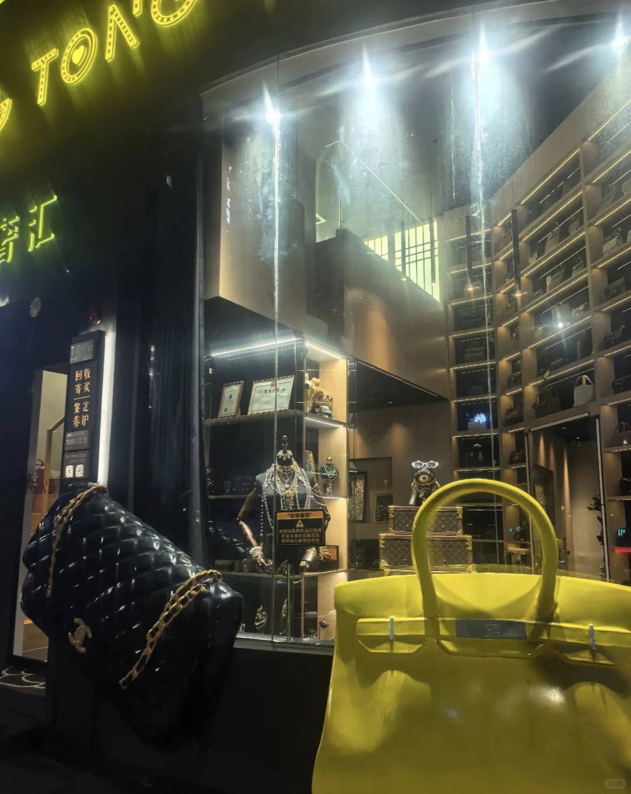
> [OCR] TON
奢汇
回收 买 定 养护
10:00-22:00
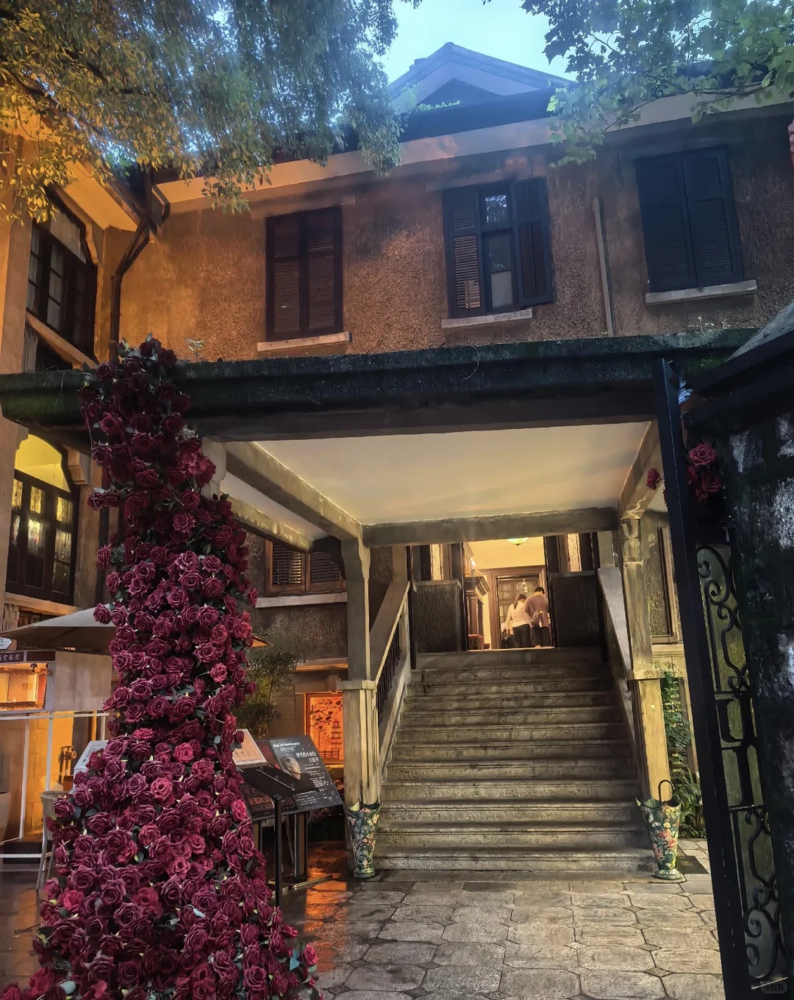
> [OCR] 五大道小洋楼
1928-1937
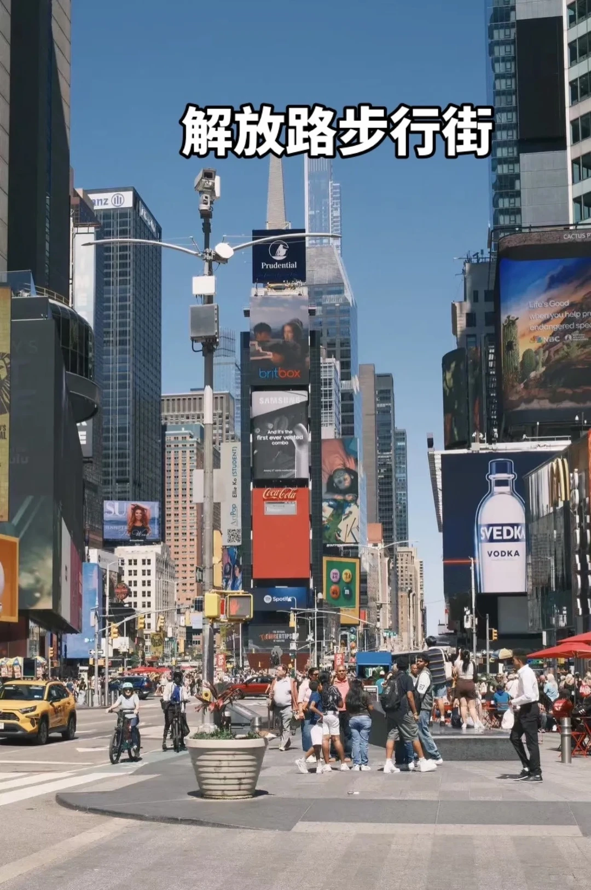
> [OCR] 解放路步行街
Prudential
britbox
SAMSUNG
And it's the first ever verified combo.
Coca-Cola
Spotify
SVEDKA
VODKA
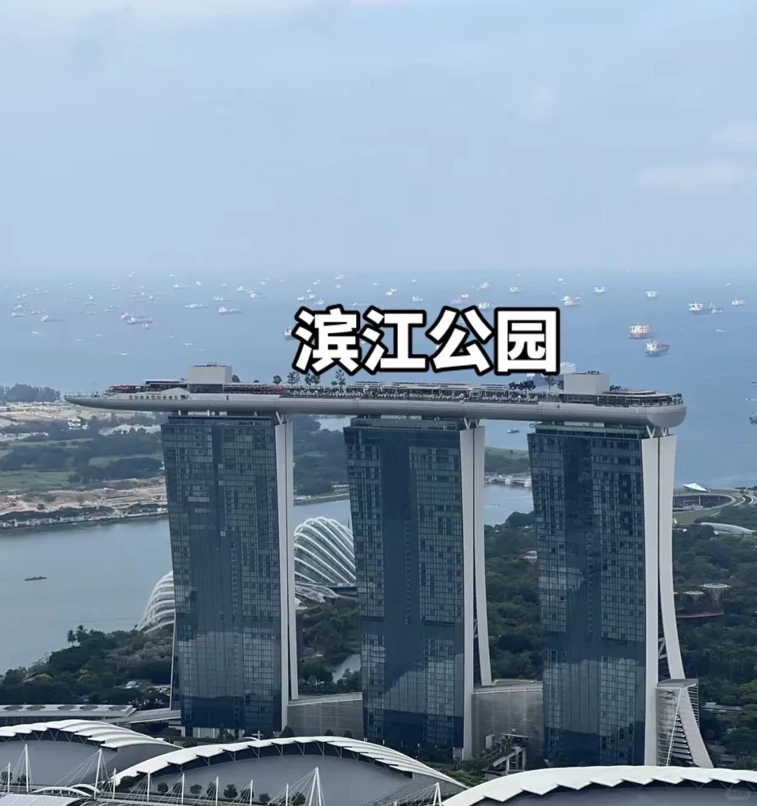
> [OCR] 滨江公园
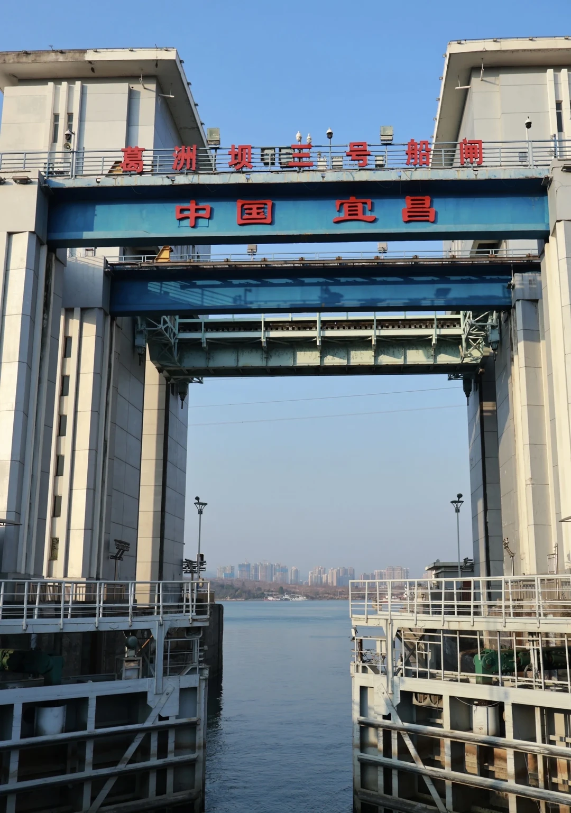
> [OCR] 葛洲坝三号船闸
中国宜昌
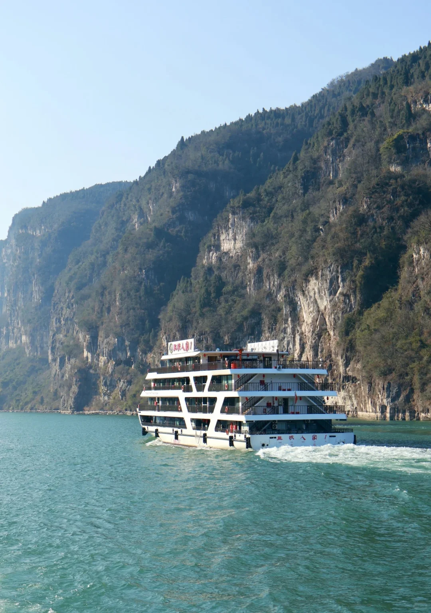
> [OCR] 三峡人家
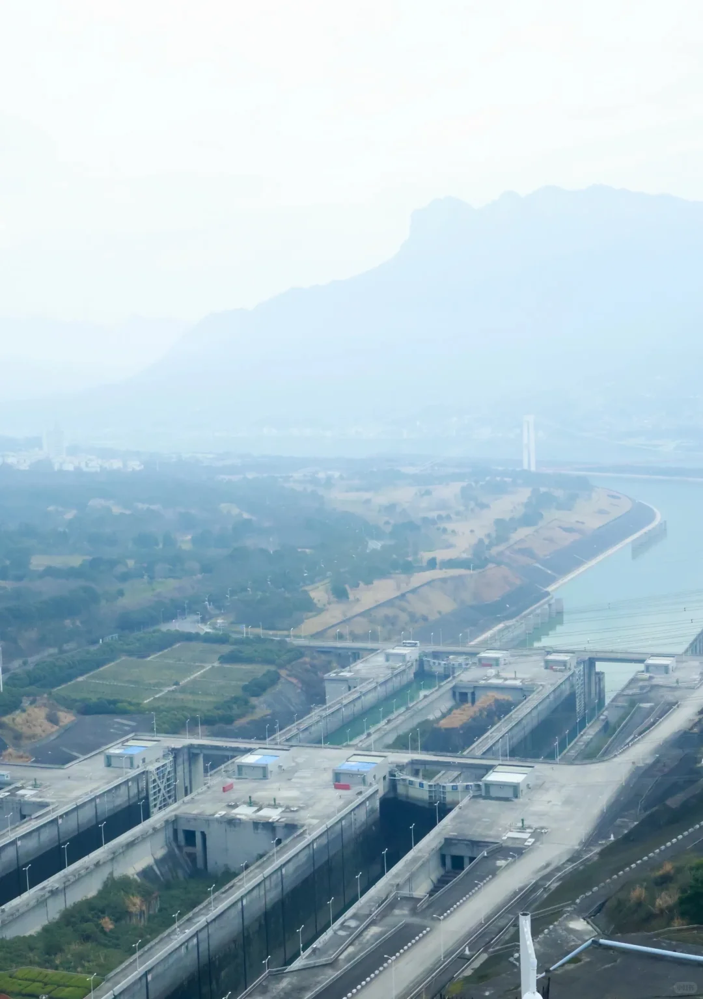
> [OCR] [?]
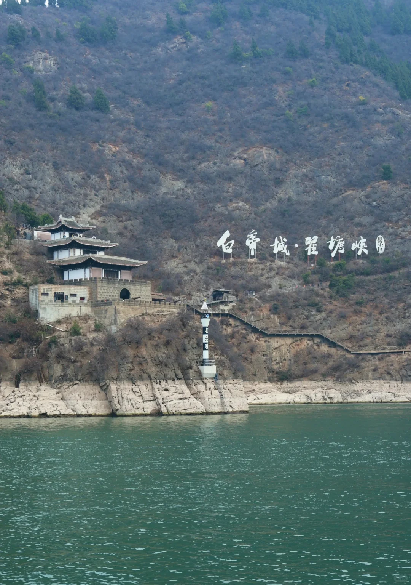
> [OCR] 白帝城·瞿塘峡

## 正文
来宜昌旅行不用赶行程，既能乘船领略长江峡谷壮阔风光，也能钻进解放路步行街、二马路老街区捕捉市井氛围感，这次行程吃住玩体验全程在线，整理实用旅拍攻略分享给大家。
	
🌊核心游玩&旅拍体验
	
1. 两坝一峡游船行程
	
乘船穿行西陵峡原生态江面，两岸青山连绵、碧水澄澈，甲板是绝佳人像取景位；亲历葛洲坝船闸水涨船高的奇妙过程，近距离感受大国水利工程的震撼；上岸登上坛子岭、185平台俯瞰三峡大坝全景，壮阔工程搭配自然山水，广角拍摄氛围感拉满，晴天光影通透，阴天自带水墨质感。
	
2. 老城街巷漫步取景
	
游玩返程后步行打卡解放路步行街，街边大树撑起连片绿荫，老式居民楼、临街小吃店错落排布，午后树荫光影错落，随手就能拍出生活化街拍大片；顺路逛二马路复古街区，欧式老建筑适合拍复古风人像，沿街小店烟火浓郁，萝卜饺子、手工凉虾、红油小面等本地小吃随处可尝。
	
🏨住宿小记（雅阁欢聚酒店·滨江公园CBD店）
	
整趟行程我选择入住雅阁欢聚酒店（宜昌滨江公园CBD购物中心店），位置十分省心：地处西陵区核心地段，步行可达解放路步行街、滨江公园，打车前往两坝一峡登船码头也很便捷。房间配备乳胶床垫，逛完景点回房休憩放松感很强，楼下就是密集美食店铺，早晚觅食不用走远，自驾还能享用免费停车位，是市区游玩很合适的落脚选择。
	
📸实用旅拍小贴士
	
1. 游船穿搭优先浅色系服饰，适配青山江水的清新色调，甲板风大建议随身带薄外套；
	
2. 老城街区推荐午后拍摄，树荫柔光柔和，商铺招牌、老式窗框都是天然取景元素；
	
3. 行程动线参考：白天体验两坝一峡游船→傍晚回市区逛步行街觅食→饭后步行至滨江公园看江景日落，节奏松弛不赶路。
	
✨整体总结
	
宜昌兼具雄浑的江峡风光与温柔老城烟火，既能打卡硬核地标，也能沉浸式感受本地日常，选好市中心住宿串联点位，短途出行轻松又充实，非常适合情侣结伴、家庭休闲出游。#视听长江遇见知音湖北[话题]# #两坝一峡[话题]#

---