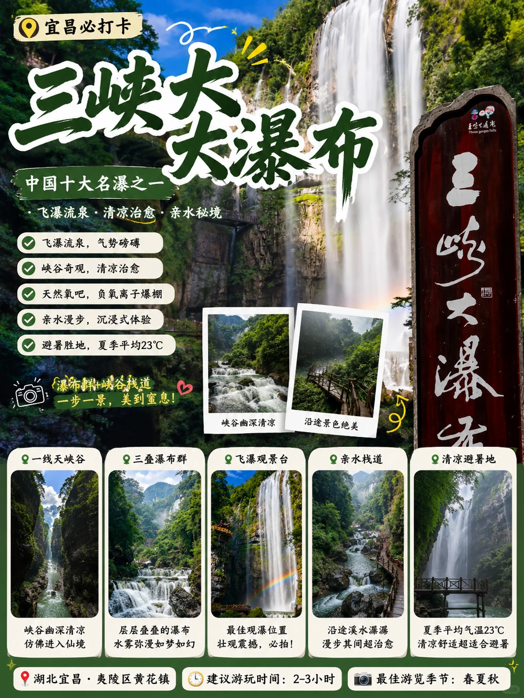
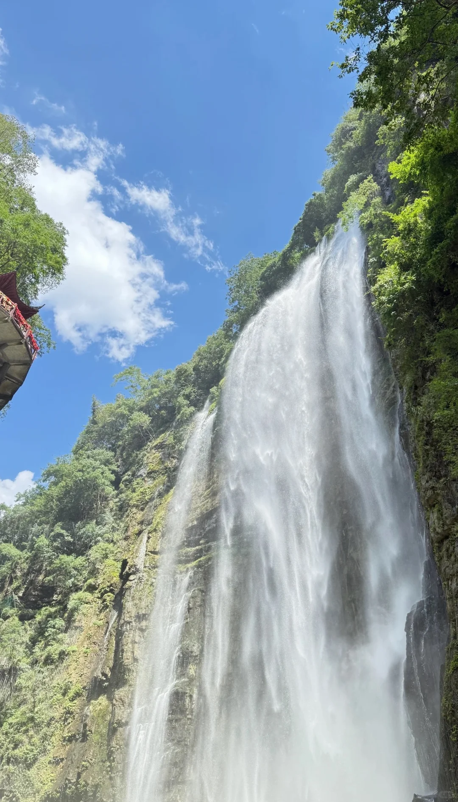
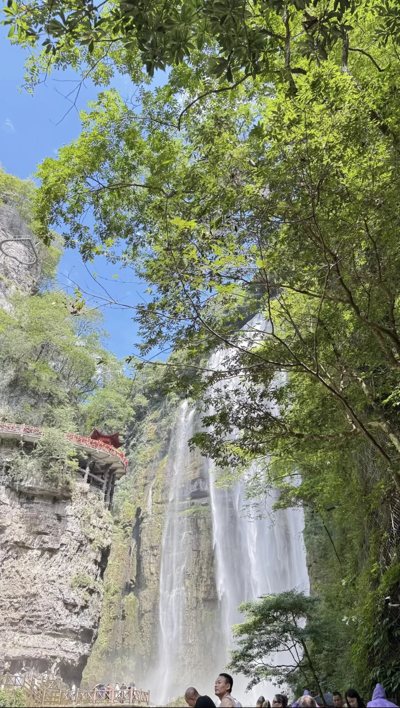
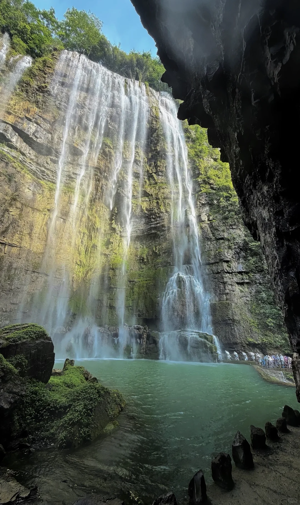
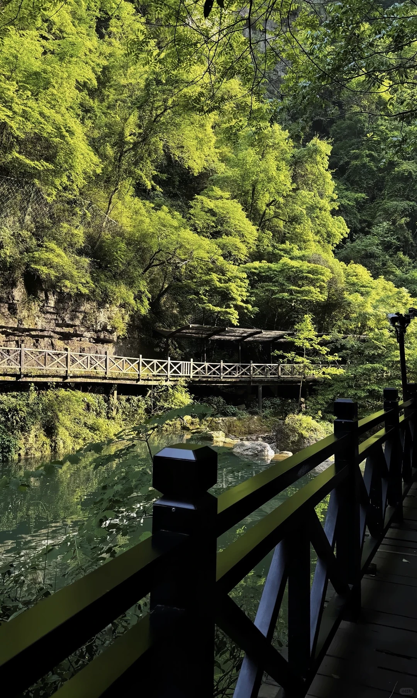
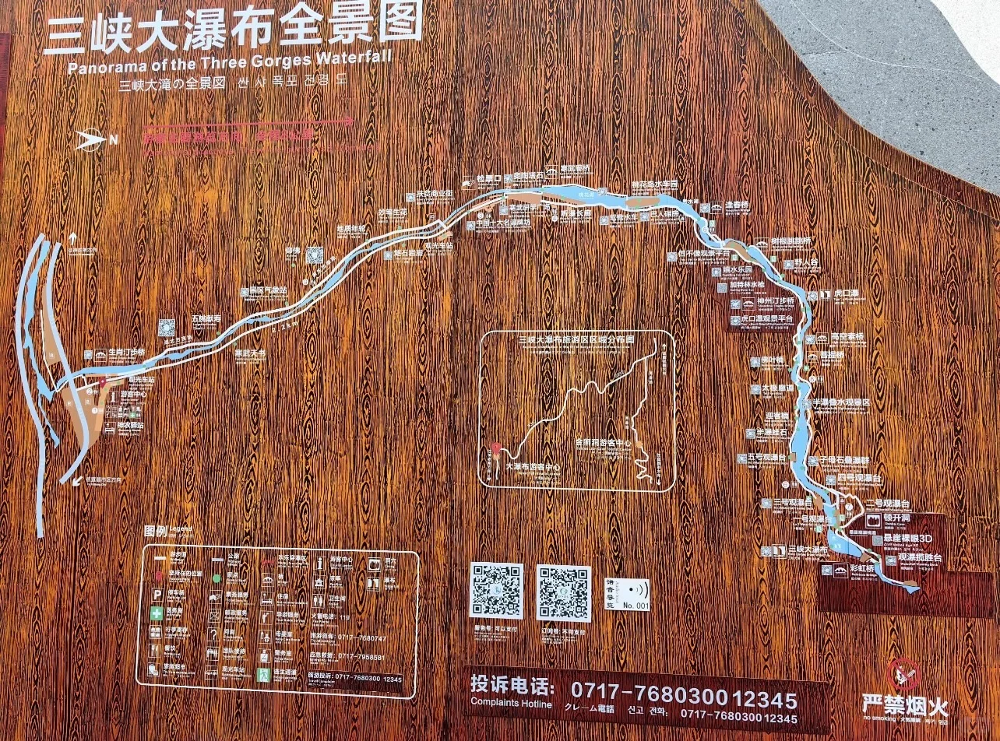

# 宜昌避暑天花板🔥三峡大瀑布半日游纯玩攻略

- 作者: 精彩国际旅行社
- 👍1 · 💬 · ⭐1 · 图 6
- feed_id: 6a3b72c7000000001101056f

> [OCR] 宜昌必打卡
三峡大瀑布

中国十大名瀑之一
飞瀑流泉·清凉治愈·亲水秘境

✅ 飞瀑流泉，气势磅礴
✅ 峡谷奇观，清凉治愈
✅ 天然氧吧，负氧离子爆棚
✅ 亲水漫步，沉浸式体验
✅ 避暑胜地，夏季平均23℃

📸【瀑布群+峡谷栈道】一步一景，美到窒息！

一线天峡谷
三叠瀑布群
飞瀑观景台
亲水栈道
清凉避暑地

峡谷幽深清凉仿佛进入仙境
层层叠叠的瀑布水雾弥漫如梦如幻
最佳观瀑位置壮观震撼，必拍！
沿途溪水流潺漫步其间超治愈
夏季平均气温23℃清凉舒适超适合避暑

📍 湖北宜昌·夷陵区黄花镇
🕒 建议游玩时间：2-3小时
📷 最佳游览季节：春夏秋

> [OCR] system

> [OCR] [?]

> [OCR] system

> [OCR] 小米手机

> [OCR] 三峡大瀑布全景图
Panorama of the Three Gorges Waterfall
三峽大滝の全景図
산사폭포 전경도
N
[方向指示]
[方向指示]
[方向指示]
[方向指示]
[方向指示]
[方向指示]
[方向指示]
[方向指示]
[方向指示]
[方向指示]
[方向指示]
[方向指示]
[方向指示]
[方向指示]
[方向指示]
[方向指示]
[方向指示]
[方向指示]
[方向指示]
[方向指示]
[方向指示]
[方向指示]
[方向指示]
[方向指示]
[方向指示]
[方向指示]
[方向指示]
[方向指示]
[方向指示]
[方向指示]
[方向指示]
[方向指示]
[方向指示]
[方向指示]
[方向指示]
[方向指示]
[方向指示]
[方向指示]
[方向指示]
[方向指示]
[方向指示]
[方向指示]
[方向指示]
[方向指示]
[方向指示]
[方向指示]
[方向指示]
[方向指示]
[方向指示]
[方向指示]
[方向指示]
[方向指示]
[方向指示]
[方向指示]
[方向指示]
[方向指示]
[方向指示]
[方向指示]
[方向指示]
[方向指示]
[方向指示]
[方向指示]
[方向指示]
[方向指示]
[方向指示]
[方向指示]
[方向指示]
[方向指示]
[方向指示]
[方向指示]
[方向指示]
[方向指示]
[方向指示]
[方向指示]
[方向指示]
[方向指示]
[方向指示]
[方向指示]
[方向指示]
[方向指示]
[方向指示]
[方向指示]
[方向指示]
[方向指示]
[方向指示]
[方向指示]
[方向指示]
[方向指示]
[方向指示]
[方向指示]
[方向指示]
[方向指示]
[方向指示]
[方向指示]
[方向指示]
[方向指示]
[方向指示]
[方向指示]
[方向指示]
[方向指示]
[方向指示]
[方向指示]
[方向指示]
[方向指示]
[方向指示]
[方向指示]
[方向指示]
[方向指示]
[方向指示]
[方向指示]
[方向指示]
[方向指示]
[方向指示]
[方向指示]
[方向指示]
[方向指示]
[方向指示]
[方向指示]
[方向指示]
[方向指示]
[方向指示]
[方向指示]
[方向指示]
[方向指示]
[方向指示]
[方向指示]
[方向指示]
[方向指示]
[方向指示]
[方向指示]
[方向指示]
[方向指示]
[方向指示]
[方向指示]
[方向指示]
[方向指示]
[方向指示]
[方向指示]
[方向指示]
[方向指示]
[方向指示]
[方向指示]
[方向指示]
[方向指示]
[方向指示]
[方向指示]
[方向指示]
[方向指示]
[方向指示]
[方向指示]
[方向指示]
[方向指示]
[方向指示]
[方向指示]
[方向指示]
[方向指示]
[方向指示]
[方向指示]
[方向指示]
[方向指示]
[方向指示]
[方向指示]
[方向指示]
[方向指示]
[方向指示]
[方向指示]
[方向指示]
[方向指示]
[方向指示]
[方向指示]
[方向指示]
[方向指示]
[方向指示]
[方向指示]
[方向指示]
[方向指示]
[方向指示]
[方向指示]
[方向指示]
[方向指示]
[方向指示]
[方向指示]
[方向指示]
[方向指示]
[方向指示]
[方向指示]
[方向指示]
[方向指示]
[方向指示]
[方向指示]
[方向指示]
[方向指示]
[方向指示]
[方向指示]
[方向指示]
[方向指示]
[方向指示]
[方向指示]
[方向指示]
[方向指示]
[方向指示]
[方向指示]
[方向指示]
[方向指示]
[方向指示]
[方向指示]
[方向指示]
[方向指示]
[方向指示]
[方向指示]
[方向指示]
[方向指示]
[方向指示]
[方向指示]
[方向指示]
[方向指示]
[方向指示]
[方向指示]
[方向指示]
[方向指示]
[方向指示]
[方向指示]
[方向指示]
[方向指示]
[方向指示]
[方向指示]
[方向指示]
[方向指示]
[方向指示]
[方向指示]
[方向指示]
[方向指示]
[方向指示]
[方向指示]
[方向指示]
[方向指示]
[方向指示]
[方向指示]
[方向指示]
[方向指示]
[方向指示]
[方向指示]
[方向指示]
[方向指示]
[方向指示]
[方向指示]
[方向指示]
[方向指示]
[方向指示]
[方向指示]
[方向指示]
[方向指示]
[方向指示]
[方向指示]
[方向指示]
[方向指示]
[方向指示]
[方向指示]
[方向指示]
[方向指示]
[方向指示]
[方向指示]
[方向指示]
[方向指示]
[方向指示]
[方向指示]
[方向指示]
[方向指示]
[方向指示]
[方向指示]
[方向指示]
[方向指示]
[方向指示]
[方向指示]
[方向指示]
[方向指示]
[方向指示]
[方向指示]
[方向指示]
[方向指示]
[方向指示]
[方向指示]
[方向指示]
[方向指示]
[方向指示]
[方向指示]
[方向指示]
[方向指示]
[方向指示]
[方向指示]
[方向指示]
[方向指示]
[方向指示]
[方向指示]
[方向指示]
[方向指示]
[方向指示]
[方向指示]
[方向指示]
[方向指示]
[方向指示]
[方向指示]
[方向指示]
[方向指示]
[方向指示]
[方向指示]
[方向指示]
[方向指示]
[方向指示]
[方向指示]
[方向指示]
[方向指示]
[方向指示]
[方向指示]
[方向指示]
[方向指示]
[方向指示]
[方向指示]
[方向指示]
[方向指示]
[方向指示]
[方向指示]
[方向指示]
[方向指示]
[方向指示]
[方向指示]
[方向指示]
[方向指示]
[方向指示]
[方向指示]
[方向指示]
[方向指示]
[方向指示]
[方向指示]
[方向指示]
[方向指示]
[方向指示]
[方向指示]
[方向指示]
[方向指示]
[方向指示]
[方向指示]
[方向指示]
[方向指示]
[方向指示]
[方向指示]
[方向指示]
[方向指示]
[方向指示]
[方向指示]
[方向指示]
[方向指示]
[方向指示]
[方向指示]
[方向指示]
[方向指示]
[方向指示]
[方向指示]
[方向指示]
[方向指示]
[方向指示]
[方向指示]
[方向指示]
[方向指示]
[方向指示]
[方向指示]
[方向指示]
[方向指示]
[方向指示]
[方向指示]
[方向指示]
[方向指示]
[方向指示]
[方向指示]
[方向指示]
[方向指示]
[方向指示]
[方向指示]
[方向指示]
[方向指示]
[方向指示]
[方向指示]
[方向指示]
[方向指示]
[方向指示]
[方向指示]
[方向指示]
[方向指示]
[方向指示]
[方向指示]
[方向指示]
[方向指示]
[方向指示]
[方向指示]
[方向指示]
[方向指示]
[方向指示]
[方向指示]
[方向指示]
[方向指示]
[方向指示]
[方向指示]
[方向指示]
[方向指示]
[方向指示]
[方向指示]
[方向指示]
[方向指示]
[方向指示]
[方向指示]
[方向指示]
[方向指示]
[方向指示]
[方向指示]
[方向指示]
[方向指示]
[方向指示]
[方向指示]
[方向指示]
[方向指示]
[方向指示]
[方向指示]
[方向指示]
[方向指示]
[方向指示]
[方向指示]
[方向指示]
[方向指示]
[方向指示]
[方向指示]
[方向指示]
[方向指示]
[方向指示]
[方向指示]
[方向指示]
[方向指示]
[方向指示]
[方向指示]
[方向指示]
[方向指示]
[方向指示]
[方向指示]
[方向指示]
[方向指示]
[方向指示]
[方向指示]
[方向指示]
[方向指示]
[方向指示]
[方向指示]
[方向指示]
[方向指示]
[方向指示]
[方向指示]
[方向指示]
[方向指示]
[方向指示]
[方向指示]
[方向指示]
[方向指示]
[方向指示]
[方向指示]
[方向指示]
[方向指示]
[方向指示]
[方向指示]
[方向指示]
[方向指示]
[方向指示]
[方向指示]
[方向指示]
[方向指示]
[方向指示]
[方向指示]
[方向指示]
[方向指示]
[方向指示]
[方向指示]
[方向指示]
[方向指示]
[方向指示]
[方向指示]
[方向指示]
[方向指示]
[方向指示]
[方向指示]
[方向指示]
[方向指示]
[方向指示]
[方向指示]
[方向指示]
[方向指示]
[方向指示]
[方向指示]
[方向指示]
[方向指示]
[方向指示]
[方向指示]
[方向指示]
[方向指示]
[方向指示]
[方向指示]
[方向指示]
[方向指示]
[方向指示]
[方向指示]
[方向指示]
[方向指示]
[方向指示]
[方向指示]
[方向指示]
[方向指示]
[方向指示]
[方向指示]
[方向指示]
[方向指示]
[方向指示]
[方向指示]
[方向指示]
[方向指示]
[方向指示]
[方向指示]
[方向指示]
[方向指示]
[方向指示]
[方向指示]
[方向指示]
[方向指示]
[方向指示]
[方向指示]
[方向指示]
[方向指示]
[方向指示]
[方向指示]
[方向指示]
[方向指示]
[方向指示]
[方向指示]
[方向指示]
[方向指示]
[方向指示]
[方向指示]
[方向指示]
[方向指示]
[方向指示]
[方向指示]
[方向指示]
[方向指示]
[方向指示]
[方向指示]
[方向指示]
[方向指示]
[方向指示]
[方向指示]
[方向指示]
[方向指示]
[方向指示]
[方向指示]
[方向指示]
[方向指示]
[方向指示]
[方向指示]
[方向指示]
[方向指示]
[方向指示]
[方向指示]
[方向指示]
[方向指示]
[方向指示]
[方向指示]
[方向指示]
[方向指示]
[方向指示]
[方向指示]
[方向指示]
[方向指示]
[方向指示]
[方向指示]
[方向指示]
[方向指示]
[方向指示]
[方向指示]
[方向指示]
[方向指示]
[方向指示]
[方向指示]
[方向指示]
[方向指示]
[方向指示]
[方向指示]
[方向指示]
[方向指示]
[方向指示]
[方向指示]
[方向指示]
[方向指示]
[方向指示]
[方向指示]
[方向指示]
[方向指示]
[方向指示]
[方向指示]
[方向指示]
[方向

## 正文
谁还在跑黄果树！湖北藏着102米巨型瀑布，能直接穿进水帘洞，晴天自带彩虹，半天就能玩完，不用自驾太省心💦
🌊景区封神亮点
国家5A三峡大瀑布，高102m宽80m，比黄果树还高30米！
1. 沉浸式穿瀑（必玩）
钻进瀑布背后栈道，漫天水雾扑面而来，轰鸣声环绕全身，像闯进仙侠水帘洞，晴天阳光折射直接出彩虹，人走彩虹跟着走，氛围感直接拉满
2. 30+小众打卡点
桃花湖、网红吊桥、子母叠瀑、悬崖观光电梯、复古水车石磨，一路溪水潺潺，森林覆盖率96%，全程20℃天然空调房
3. 老少友好
平缓溯溪步道，不用高强度爬山，带娃玩水、老人吸氧散步都合适，纯玩无购物！
🚌懒人直通车半日班｜不用做攻略
每日两班天天发团，市区三大站点就近上车，正规空调大巴+导游+门票全包
上午班（早逛人少拍照爽）
接站：均瑶07:30→万达07:40→东站08:00
返程：东站13:30→万达13:45→均瑶14:00
游览2.5h，错峰避开人流，上午光线超容易拍到彩虹🌈
下午班（睡懒觉党首选）
接站：东站13:30→万达13:45→均瑶14:00
返程：东站19:00→万达19:10→均瑶19:30
下午逆光水雾仙气足，傍晚晚霞配瀑布超出片
✅套餐包含：往返大巴座位+景区大门票+全程导游+旅行社责任险
❌自理：景区往返观光电车20元/人（自愿，步行30分钟，懒人必坐省体力）
📸5个零废片拍照机位
1. 穿瀑水帘洞：侧面抓拍，水雾裹住发丝，清冷仙侠大片，穿浅色裙子巨出片
2. 网红吊桥：走动回头抓拍，青山溪流做背景，森系原图直出
3. 悬崖观景台：广角拍完整瀑布全景，遇上彩虹直接封神
🎒出行必备清单（避坑干货）
1. 穿搭：白/浅蓝/淡黄连衣裙、速干短袖，防滑溯溪鞋/洞洞鞋；别穿纯棉深色，沾水贴身巨难受
2. 刚需：加厚一次性雨衣（景区薄款一冲就破）、防水手机袋、一套换洗衣物、干毛巾
3. 加分：墨镜、遮阳帽、防蚊喷雾，自带矿泉水零食（景区物价偏高）
4. 避雷提醒
• 穿瀑栈道地面全是青苔，全程慢走抓扶手，小心滑倒
• 不要轻信观景台免费拍照，打印照片会额外收费
• 雨伞没用！穿瀑全程大水花，雨衣才是刚需
#宜昌旅游[话题]# #三峡大瀑布[话题]# #宜昌避暑好去处[话题]# #湖北周边游[话题]# #半日游攻略[话题]# #瀑布拍照[话题]# #懒人旅游攻略[话题]# #武汉周边玩水[话题]#

---