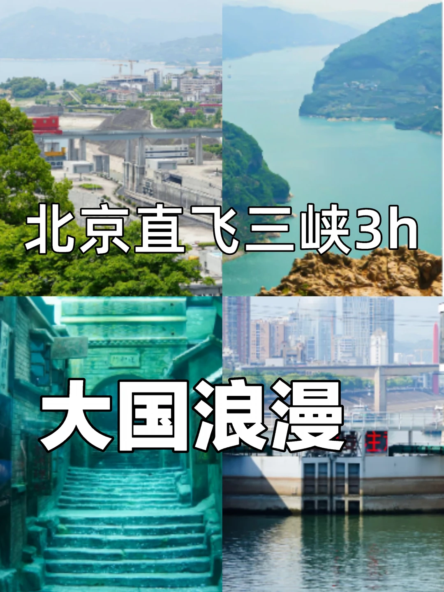

# 北京直飞3h❗️读懂三峡大坝，大国重器的浪

- 作者: 北京免费活动挖掘机
- 👍 · 💬 · ⭐1 · 图 1
- feed_id: 6a669c88000000001b01f65f

> [OCR] 北京直飞三峡3h
大国浪漫

## 正文
大家好，我是成佳，很高兴认识你！
一直听说三峡大坝，但是没有很深的了解，今天稍微整理了下～
	
🏗️三峡大坝：运行原理与时代意义
三峡大坝利用长江天然水位落差，拦江蓄水形成上下游水位差，水流驱动巨型水轮机发电机组，将水能转化为清洁电能，源源不断输送至全国。
	
✈️交通出行攻略
1.北京直飞宜昌仅3小时航程，落地后两种出行方式可选：
2.自驾：走G348三峡专用公路，需提前办理通行准入证
	
📍深度景点攻略（情怀向，无浅层打卡）
1. 三峡大坝枢纽景区
登上坛子岭观景台，俯瞰坝体全貌，近距离感受泄洪闸、发电机组的宏伟格局，了解防洪调度、发电运行的核心逻辑，读懂工程背后守护长江的使命。
	
2. 三峡移民纪念园区
走进移民博物馆，翻阅三峡搬迁的历史档案
	
3. 西陵峡原生态江段
乘船穿行西陵峡，感受长江峡谷的自然壮阔
	
4. 石牌要塞 & 老黄陵庙
探访长江古要塞遗迹，回望长江流域千年治水历史，见证从古至今国人治理江河、利用自然的不懈探索。
	
⚠️大众点评实测10条实用出行建议
1. 三峡大坝园区免费开放，在官方实名预约，升船机、游船项目需单独购票，无现场临时售票。
2. 升船机每日班次固定，购票后务必按时登船，错过班次无法改签退费。
3. 夏季江边紫外线强、蚊虫较多，备好防晒用品与驱蚊液，早晚江面温差大，建议携带薄外套。
4. 游船优先选择日间班次，可完整观赏西陵峡江面风貌，夜场视野受限，体验感大打折扣。
5. 景区内部餐饮溢价较高，可自备饮用水与便携零食，宜昌市区美食性价比更高。
6. 葛洲坝船闸通行时长约1小时，船舱内手机信号较弱，可提前下载相关历史资料深度游览。
7. 节假日大坝观景台人流密集，建议上午9点前抵达。
8. 莲沱畔区域禁止明火露营，江边浅滩水流复杂，看护好孩童，远离深水区域。
9. 鹰嘴岩登山步道台阶陡峭，老人、幼儿不建议前往，登山务必穿防滑鞋。
10. 三峡相关展馆内禁止大声喧哗，遵守场馆规定，静心感受工程历史与移民故事。
	
持续更新：北京热门打卡地🔥
关注我进群，get更多北京吃喝玩乐好去处❗️
#北京出发旅行[话题]# #宜昌旅游[话题]# #三峡大坝[话题]# #大国重器[话题]# #三峡人文历史[话题]# #长江治理[话题]# #国内深度游[话题]# #暑期红色旅行[话题]# #湖北旅游[话题]# #家国情怀旅行[话题]#

---