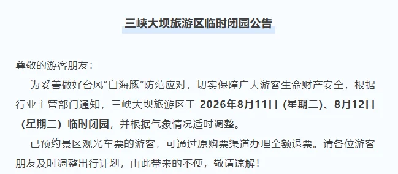

# 受台风影响 三峡大坝明后天闭园一天

- 作者: 小王旅途记事
- 👍 · 💬 · ⭐ · 图 1
- feed_id: 6a798a3c00000000240267d6

> [OCR] 三峡大坝旅游区临时闭园公告

尊敬的游客朋友：

为妥善做好台风“白海豚”防范应对，切实保障广大游客生命财产安全，根据行业主管部门通知，三峡大坝旅游区于2026年8月11日(星期二)、8月12日(星期三)临时闭园，并根据气象情况适时调整。

已预约景区观光车票的游客，可通过原购票渠道办理全额退票。请各位游客朋友及时调整出行计划，由此带来的不便，敬请谅解！

## 正文
⚠️紧急通知｜三峡大坝8.11‑8.12临时闭园 准备来宜昌游玩的宝子千万注意❗
受台风“白海豚”影响 三峡大坝旅游区开启临时闭园管控
⏰闭园时间： 8月11日（周二）—8月12日（周三） 后续开放时间会根据天气动态调整
🎫退票须知： 已经预约观光车票的朋友 在原购票渠道就可以办理全额退款  近期打算打卡三峡大坝的小伙伴 记得及时更改出行行程，不要白跑一趟～ 出门游玩优先留意天气，安全第一🌧️
#宜昌旅游[话题]# #三峡大坝[话题]# #宜昌出行[话题]##两坝一峡[话题]# #宜昌[话题]#

---